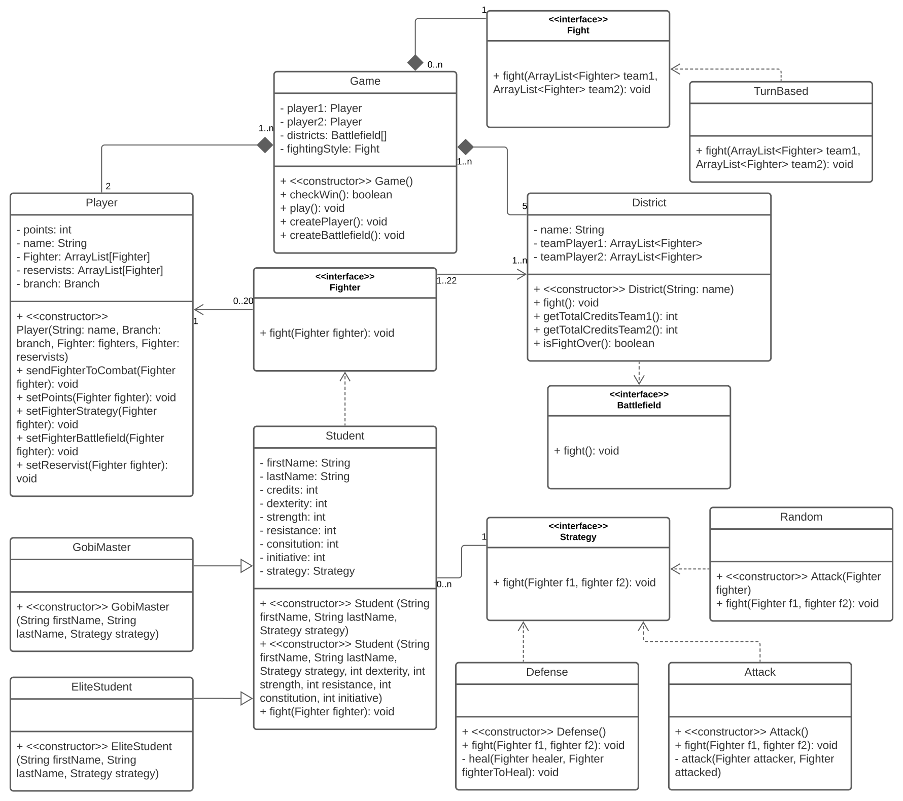
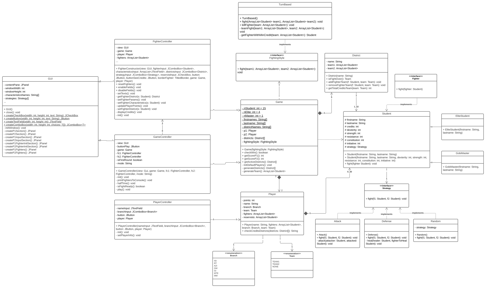

# Rapport du projet LO02 C'est du brutal

## Diagrammes de classes

|    |
|:--------------------------------:|
|   Diagramme de classes initial   |

|       |
|:---------------------------------:|
|    Diagramme de classes final     |

**Les différences majeures**

- Bien que pas demandées, nous avons ajouté les classes reliées à l'interface graphique, "GUI", "FighterController", "GameController", "PlayerController".
- L'interface "Fight" a été renommée en "FightingStyle" par souci de compréhension.
- Ajout d'un attribut "team" dans la classe "Player", pour différencier les différencier dans les districts.
- Suppression de l'interface "Battlefield", car inutile.

## Etat de l'application

Le jeu est fonctionnel, et nous l'avons bien developpé en respectant le modèle MVC.

**Etape 1**

Les points des joueurs sont bien mis à jour en fonction de ceux qu'ils affectent à leurs combattants. Les combattants sont initialisés avec les caractéristiques telles que définit dans le sujet ainsi que la stratégie "Attack" initialisée par défaut. Le joueur peut également définir 5 réservistes.
**Etape 2**

Pour les besoins de tests ainsi que pour la soutenance, nous avons décidé de créer 2 modes.
- Mode "demo" qui vérifie seulement qu'il y a au moins un combattant sur chaque quartier.
- Mode "game" qui correspond au sujet initial.

**Etape 3**

La mêlée se déroule tel que définit dans le sujet, les combattants sont ordonnés en fonction de leur initiative, les combats sont arrêtés dès lors qu'une zone est contrôlée par un joueur.

**Etape 4**

Pendant la trêve, les joueurs peuvent:
- Envoyer leurs réservistes au combat.
- Redéployer les combattants d'une zone contrôlée.
- Connaitre le total de crédit ECTS par zone de combat.

**Etape 5**

Lorsqu'un joueur gagne (il contrôle 3 zones) un message est alors affiche et la partie est arrêtée.